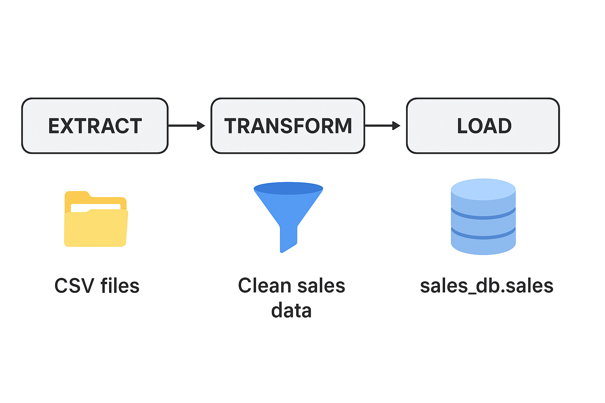
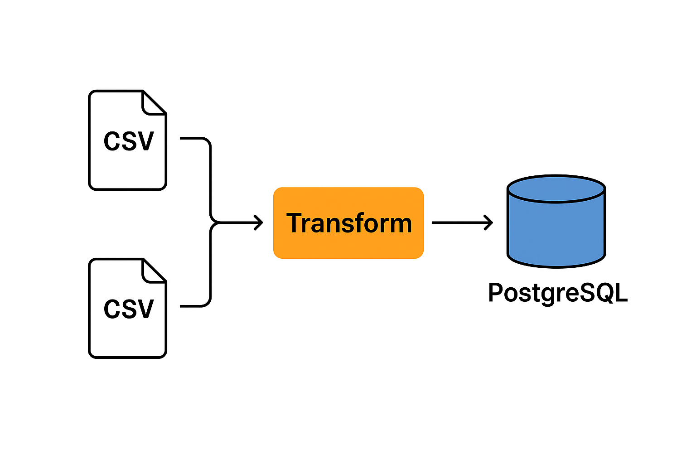

# ETL_SALES_PROJECT

## Overview

ETL_SALES_PROJECT is a small-scale ETL (Extract → Transform → Load) project that demonstrates how to generate, clean, transform, and load sales data into a PostgreSQL database. This project is ideal for learning ETL concepts, pandas data manipulation, and PostgreSQL integration.

## Project Structure

ETL_SALES_PROJECT/
├─ data/                <-- CSV sales files
│  ├─ store_1_sales.csv
│  ├─ store_2_sales.csv
│  └─ store_3_sales.csv
├─ etl/
│  ├─ extract.py        <-- Extracts data from CSV (and optionally API)
│  ├─ transform.py      <-- Cleans and transforms data
│  ├─ load.py           <-- Loads data into PostgreSQL
│  └─ run_etl.py        <-- Runs the full ETL pipeline
├─ data_generator/
│  └─ generate_csv.py   <-- Generates random sales CSV files for testing
├─ api/                 <-- Placeholder for optional API integration
│  ├─ __init__.py
│  ├─ fetch_data.py
│  ├─ auth.py
│  └─ utils.py
├─ images/              <-- Diagrams for project visualization
│  ├─ diagram1.png
│  └─ diagram2.png
└─ README.md            <-- Project documentation
├── .gitignore

## Features

* Generate random sales CSV files for multiple stores.
* Read and consolidate CSV files using pandas.
* Clean data (remove duplicates, handle missing values).
* Load transformed data into a PostgreSQL database.
* Optional API integration folder ready for future use.

## Requirements

* Python 3.8+
* pandas
* SQLAlchemy
* psycopg2
* requests (if using API)
* PostgreSQL database

Install dependencies using:

bash

pip install pandas sqlalchemy psycopg2-binary requests

## How to Run

1. **Generate CSV data** (optional):

```bash
python data_generator/generate_csv.py
```

2. **Run the ETL pipeline**:


```bash
python etl/run_etl.py
```
## Project Workflow Visualization

*Images to make the workflow clear:*

  



* The pipeline will read CSV files, transform them, and load them into PostgreSQL.
* If you have an API, you can set `API_URL` and `API_KEY` in `run_etl.py` to fetch online data as well.

## Notes

* The `api` folder is optional and currently serves as a placeholder for future API data integration.
* This project demonstrates the **basic ETL workflow** and helps in learning basic ETL concepts.

## Author

Renu Joshi
